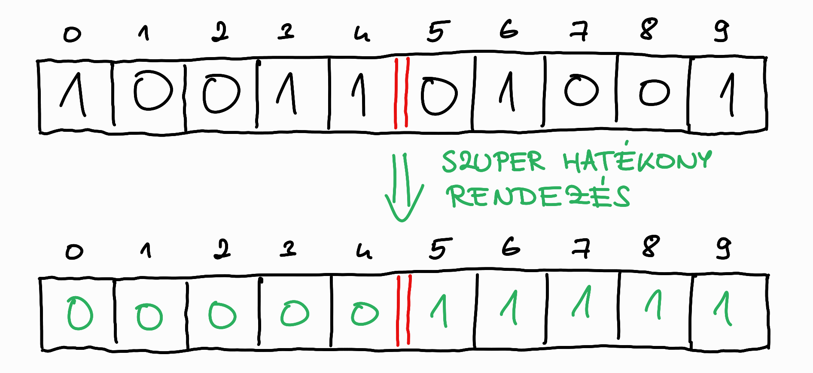

# Bárcsak tudnék rendezni (egy valszámos feladat)

Ebben a cikkben szeretnék egy kicsit bővebben a [Codeforces 1753C: Wish I Knew How to Sort](https://codeforces.com/problemset/problem/1753/C) feladat megoldásairól beszélni.

A feladatban kapunk egy bináris, $n$ elemű $a$ tömböt, amit rendezni szeretnénk, de sajnos az algel tanárunk elfelejtette megtanítani nekünk a rendezési algoritmusokat. :) Jobb ötlet híján egy randomizált módszert választunk, melyben egy lépés a következőképpen néz ki:

- Véletlenszerűen (egyenletes eloszlással, egymástól és a korábbi lépéseinktől függetlenül) rámutatunk két pozícióra a tömbben. Legyenek ezek $i$ és $j$ indexszel jelölve, ahol $i < j$.
- Ha rossz sorrendben vannak ($a_i > a_j$), megcseréljük őket, egyébként nem csinálunk semmit.

Ezt a lépést addig ismételjük, amíg a tömb rendezett nem lesz.

**Kérdés**: Mi a várható értéke a végrehajtott lépéseknek?

A feladatban technikai részlet, hogy a megoldást irreducibilis (tovább már nem egyszerűsíthető alakú) törtként kell kiírni, ennek a módszerére a végén térek ki.  

A feladatnak legalább kettő, egymástól nagyon különböző megoldása van, mindkettőt nagyon hasznos ismerni valszámos feladatok kezeléséhez.

## Megfigyelés

Az első dolog, amit a feladat kapcsán észreveszünk, hogy tudjuk hány darab $0$-ás és $1$-es található az $a$ tömbben, ami alapján be tudunk húzni egy elválasztó vonalat, ami majd a végeredményben a $0$-ák és $1$-esek határa lesz.

Ezután a véletlenül választott $i<j$ pár elhelyezkedése szerint tulajdonképpen két különböző eset van:

1. $i$ az elválasztó vonal előtt, $j$ utána van.
2. Mindkettő az elválasztó vonal előtt / után van.

Az 1. esetben ha történik csere azzal hasznos munkát végeztünk, hiszen növeltük a $0$-ák számát a vonal előtt és az $1$-esek számát a vonal után, ezzel közelebb kerültünk a célállapothoz.

A 2. esetben ha történik csere azzal nem végeztünk hasznos munkát, hiszen pusztán határokon belül mozgattunk dolgokat, továbbra is ugyanannyi $1$-est kell még a határ bal oldaláról a jobb oldalára mozgatni, miközben a helyükre $0$-ákat hozunk.

Tehát elmondható, hogy a feladat szempontjából hasznos lépés az, amikor az $i$ a határ előtt és a $j$ a határ után van és $a_i = 1$, illetve $a_j = 0$.

## Első megoldási módszer: Várható érték linearitása

## Második megoldási módszer: Markov lánc dinamikus programozással

## Megoldás kiírása irreducibilis tört alakban
